# Hi there! I'm Francis Kodama! 👋

## Welcome to my GitHub. 

---

### About Me 

🇧🇷 🇨🇦  I'm a **Technical Product Lead** with a rare combination most teams are looking for but rarely find: two decades of executive leadership *and* hands-on full-stack engineering. I don't just define the vision, I can architect, build, and ship alongside the team.

My mission is to bridge the gap between business strategy and technical execution, forming missionary teams that solve hard problems fast, and delivering products that create real impact.

⚡  **Fun fact**: I spent 20+ years leading enterprise-scale teams and managing high-impact brand programs for Walmart, Jaguar, Peugeot Citroën, and Unilever, and then purposefully pivoted to a hands-on engineering role to master the technical layer, ensuring future leadership decisions are grounded in actual architectural execution. Now I bring both worlds together, and that changes everything about how fast and how well a team can build. 
 
 
> *"In the world of software, the architect who still carries a shovel is the only one who truly knows the ground."* — Anonymous

 

 
 

---
 

### 🏗️ What I’m Building 

| Product | Strategic Value |
| :--- | :--- |
|  | A global wealth engine architected to synchronize multi-currency assets across BRL, CAD, and USD markets. |
|  | An AI-driven FinTech platform leveraging automated parsing logic for household financial intelligence. |
|  | A modular "Productivity Shell" architected to eliminate cognitive friction across fragmented technical workflows. |
|  | A secure Digital Contingency Vault architected with AES-256 encryption and event-driven fail-safe protocols for legacy asset management. |

 

---

### 💬 Connect with me

---

### 🛠️ Technologies I love and use

**Frontend & Design**

**Backend & Database**

**AI & Integrations**

**Infrastructure & Tools**

---

### 📊 Stats and Languages

   

 
